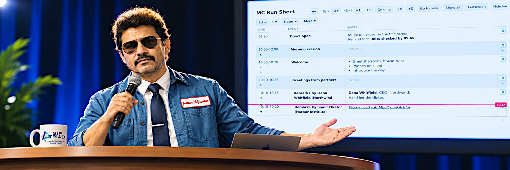
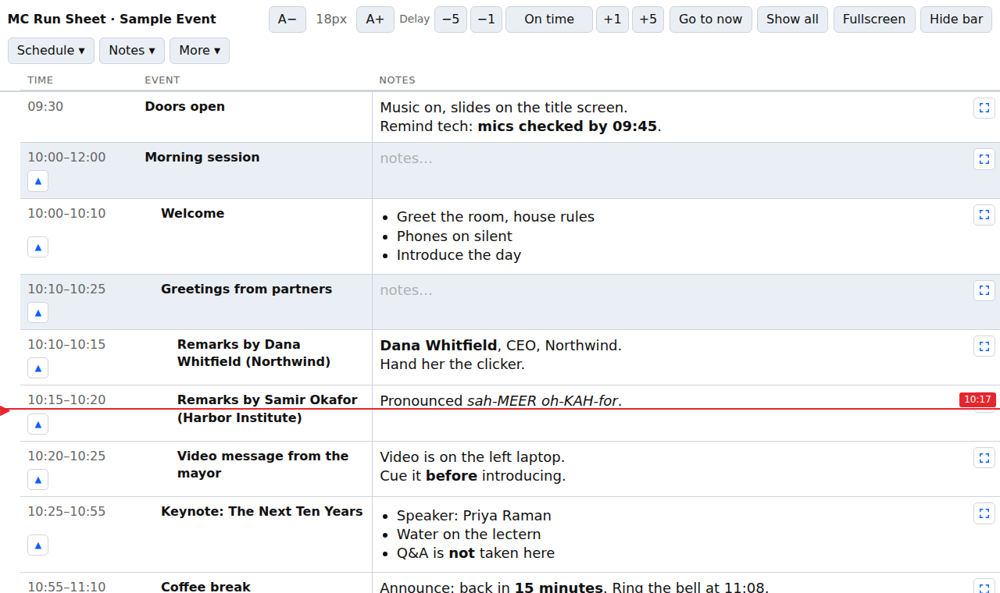
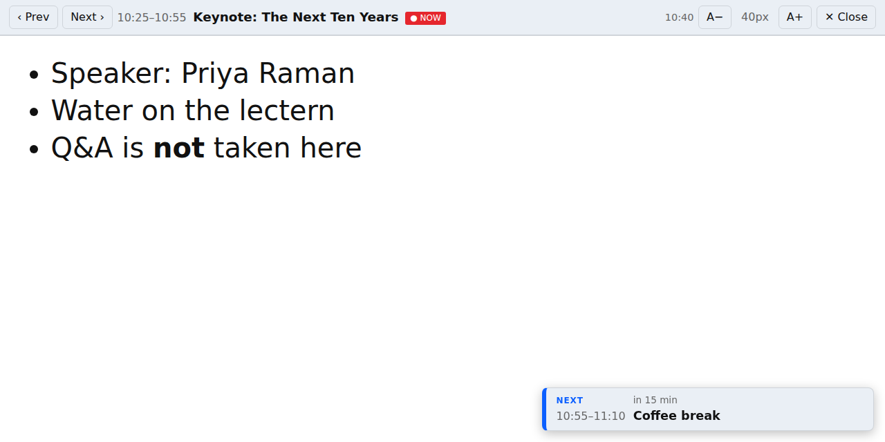

<h1 align="center" style="margin:0;">

</h1>
<h3 align="center" style="margin: 0; margin-top: 0;">
 
MC Run Sheet — because the professional MC was apparently unavailable
</h3>

  <a href="#screenshots">Screenshots</a> •
  <a href="#run-it">Run it</a> •
  <a href="#use-it">Use it</a> •
  <a href="#where-your-data-lives">Where you data lives</a>

A single-file run sheet for hosting a live event. It shows your schedule next to your speaking notes, marks where you should be right now, and prints cleanly as a paper backup.
Everything runs in the browser.

---

## Screenshots

main screen:

 

with notes maximized:

## Run it

It is quite simple.
**Locally:** download `index.html` and open it in a browser.
Or from Github Pages (your notes never leave your computer).

## Use it

**Load your schedule**
- Use **Schedule ▾ → Edit schedule…** to type it in. Changes apply only when you click **Save schedule**, so a stray click can't alter a time or title.
- or use **Schedule ▾ → Import schedule (.csv)** with the columns `start_time,end_time,description`. The end time is optional. See [`sample-schedule.csv`](sample-schedule.csv).
- A row whose time range contains the following rows becomes their group header, and those rows are indented under it.

**Write notes**
- Type directly in the Notes column. `Ctrl/Cmd+B` makes text bold and `Ctrl/Cmd+I` makes it italic.
- Click the expand icon on a row to read its notes full screen. `A−` / `A+` change the text size. The **NEXT** card at the bottom right shows what follows and when. Esc closes the view, and `Alt+←` / `Alt+→` move between rows.
- **Notes ▾** exports and imports all notes as Markdown, which is also your backup.

**During the event**
- The red line is where the schedule says you should be, based on the device clock.
- If the event runs late or early, use **Delay** (−5, −1, +1, +5). The line shifts accordingly.
- **▲** on a row hides every row above it. **Show all** brings them back.
- **Go to now**, **Fullscreen** and **Hide bar** give you more room.

**Print**
- **More ▾ → Print** prints A4 landscape with every row and an empty notes space for handwriting.

**Rehearse**
- **More ▾ → Rehearsal time…**, or add `?now=14:32` to the address, to run the sheet as if it were that time. A purple banner shows while it is active.

## Where your data lives

Notes, the edited schedule and settings are saved in the browser's local storage, for that browser, device and web address only. They are never uploaded. Use **Notes ▾ → Export notes (.md)** for a copy, and **Schedule ▾ → Export schedule (.csv)** to carry the schedule to another device.

If you host several sheets under the same `github.io` address, give each copy its own `STORE_ID` (near the top of the script in `index.html`) so they don't share data.

To change the built-in schedule, edit the rows inside `
` in `index.html`.
